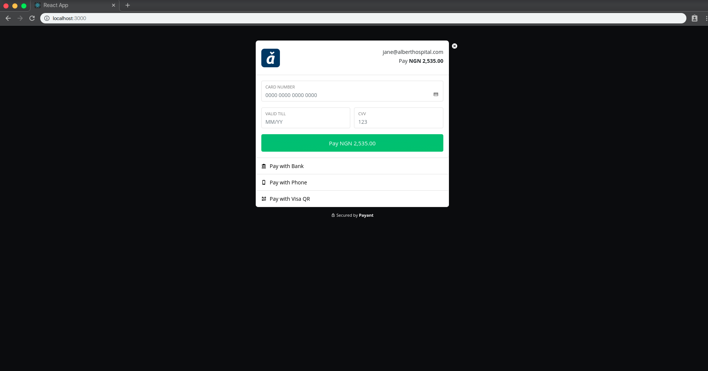

# react-payant

[](https://badge.fury.io/js/react-payant)

This is a react library for implementing payant payment inline js

## Demo



### Get Started

This React library provides a wrapper to add Paystack Payments to your React application

### Install

```
npm install react-payant --save
```

or with yarn

```
yarn add react-payant
```

### Usage

```javascript
import React, { Component } from 'react';
//import the library
import Payant from 'react-payant';

function App() {
  <Payant
    payantPublicKey={'<Your payant public key>'}
    client={{
      first_name: 'Albert',
      last_name: 'Jane',
      email: 'jane@alberthospital.com',
      phone: '+2348012345678',
    }}
    due_date="12/30/2016"
    fee_bearer="client"
    items={[
      {
        item: '.Com Domain Name Registration',
        description: 'alberthostpital.com',
        unit_cost: '2500.00',
        quantity: '1',
      },
    ]}
    callback={(response) => console.log(response)}
    close={() => console.log('closed')}
  />;
}
export default App;
```

## Note

This package should not yet be used on production or a large scale app because the tests have not been written.

## Contributing

1. Fork it!
2. Create your feature branch: `git checkout -b feature-name`
3. Commit your changes: `git commit -am 'Some commit message'`
4. Push to the branch: `git push origin feature-name`
5. Submit a pull request

## How can I thank you?

Why not star the github repo? I'd love the attention! Why not share the link for this repository on Twitter or Any Social Media? Spread the word!

Don't forget to [follow me on twitter](https://twitter.com/johnayeni_)!

Thanks!
John Ayeni.

## License

This project is licensed under the MIT License - see the [LICENSE.md](LICENSE.md) file for details

## Todo

- Write test
